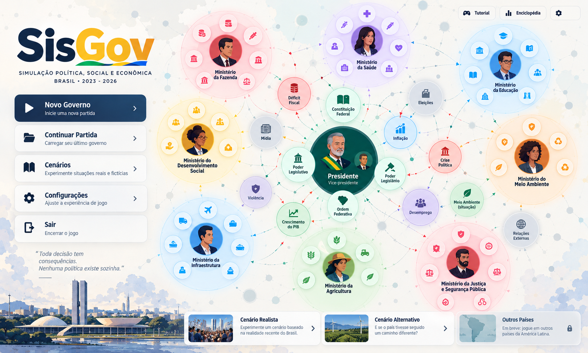

# Especificação visual: menu inicial do SisGov

**Referência visual fornecida pelo usuário em 8 de outubro de 2026.**

Este documento descreve a tela inicial mostrada na imagem. Ela introduz o jogo
e oferece os principais caminhos de entrada; o mapa de governança aparece como
ilustração de fundo e antecipa o espaço de jogo.

## Composição

A imagem é panorâmica, com proporção aproximada de 5:3 (1618 × 972 pixels).
Usa fundo claro com nuvens sutis, textura de rede e o mapa institucional
colorido ao centro e à direita. A coluna de identidade e ações ocupa o lado
esquerdo. Cartões de cenário formam uma faixa na parte inferior, sobre a
ilustração de Brasília.

### Marca e identificação

No alto à esquerda, a marca **SisGov** aparece em letras grandes azul-marinho e
amarelas, com traços verde e azul sob a palavra. Abaixo, duas linhas identificam
o produto e o recorte temporal:

- **SIMULAÇÃO POLÍTICA, SOCIAL E ECONÔMICA**
- **BRASIL · 2023 – 2026**

### Ações principais

Cinco cartões verticais, com ícone à esquerda, título, descrição curta e chevron
à direita quando indicado, oferecem:

1. **Novo Governo** — “Inicie uma nova partida”. É a ação principal, destacada
   com fundo azul e texto branco.
2. **Continuar Partida** — “Carregar seu último governo”.
3. **Cenários** — “Experimente situações reais e fictícias”.
4. **Configurações** — “Ajuste a experiência de jogo”.
5. **Sair** — “Encerrar o jogo”. O cartão não mostra chevron.

Os quatro primeiros cartões têm fundo branco ou azul, bordas suaves e aparência
de botão. O de novo jogo tem maior contraste visual para estabelecer a ação
primária.

Sob os cartões, uma frase em itálico funciona como assinatura:

> Toda decisão tem consequências.
>
> Nenhuma política existe sozinha.

Um pequeno traço horizontal aparece logo abaixo.

### Acessos auxiliares

No canto superior direito há três botões compactos:

- **Tutorial**, acompanhado de ícone de controle de jogo.
- **Enciclopédia**, acompanhado de ícone de gráfico ou barras.
- Um botão apenas com ícone de engrenagem, referente a configurações.

### Mapa ilustrativo

O mapa reproduz a linguagem visual da referência principal: uma esfera federal
verde no centro, com presidente e vice-presidente, instituições próximas e
ministérios ao redor. Cada ministério aparece como uma esfera colorida com
retrato e bolhas menores de políticas. Nós de resultado, como déficit fiscal,
mídia, eleições, inflação, desemprego, violência, crescimento do PIB, meio
ambiente e relações externas, ocupam o espaço entre as esferas.

Linhas finas com setas passam pelo fundo e conectam os nós. A rede é parte da
ilustração de abertura: reforça a ideia de que decisões públicas se relacionam
com resultados em várias áreas. Não substitui a referência detalhada do mapa em
[Mapa estratégico da governança brasileira](referencia-visual-mapa-estrategico.md).

### Cartões de cenário

Três cartões horizontais aparecem no rodapé, alinhados da esquerda para a
direita:

- **Cenário Realista** — “Experimente um cenário baseado na realidade recente
  do Brasil.” A miniatura mostra pessoas e uma cidade.
- **Cenário Alternativo** — “E se o país tivesse seguido um caminho
  diferente?” A miniatura mostra energia eólica em uma paisagem verde.
- **Outros Países** — “Em breve: jogue em outros países da América Latina.” A
  miniatura mostra um mapa estilizado e um cadeado, indicando indisponibilidade
  na imagem.

Uma ilustração panorâmica de Brasília, incluindo o Congresso Nacional e o
entorno urbano, ocupa a parte inferior esquerda como base visual da marca e do
menu.

## Hierarquia visual

1. A marca estabelece o nome e o gênero do produto.
2. **Novo Governo** é a ação de maior destaque.
3. Continuar, cenários e configurações são alternativas secundárias.
4. O mapa demonstra a escala e a organização do jogo sem cobrir os controles.
5. Os cartões inferiores apresentam cenários selecionáveis e indicam que a
   opção de outros países ainda não está disponível.
6. Tutorial e enciclopédia ficam acessíveis sem competir com a entrada em uma
   partida.

O conjunto deve parecer um menu de jogo, não uma tela administrativa: ações
claras em cartões, identidade visual forte, cenário nacional reconhecível e o
mapa como pano de fundo temático.

## Limites e decisões funcionais pendentes

Esta especificação registra a aparência e os textos da imagem. Ela não define,
por si só, o comportamento interno dos comandos:

- **Novo Governo** deverá iniciar o fluxo de nova partida conforme país,
  conteúdo e estado inicial carregados em JSON. A tela não autoriza fixar leis,
  regras ou valores da imagem como constantes do motor.
- **Continuar Partida** sugere carregar o último governo salvo. A imagem não
  especifica formato, armazenamento, seleção entre vários saves nem o tratamento
  de save incompatível.
- **Cenários** e os cartões **Cenário Realista** e **Cenário Alternativo**
  sugerem seleção de conteúdo. A lista concreta de cenários disponíveis depende
  dos pacotes carregados; os nomes e resumos da arte não substituem os JSONs.
- **Outros Países** aparece bloqueado e acompanhado de “Em breve”. Isso comunica
  indisponibilidade nesta composição, mas não define uma regra universal de
  elegibilidade do motor.
- **Configurações**, **Tutorial** e **Enciclopédia** são acessos visíveis; seus
  conteúdos, opções e telas ainda dependem dos respectivos contratos de
  produto.
- **Sair** comunica encerramento do jogo, mas a ação técnica depende do ambiente
  em que o jogo for executado.
- A data, os indicadores, retratos, instituições, políticas e ligações exibidos
  no mapa são elementos da imagem. Não são automaticamente dados reais,
  conteúdo inicial do país nem funcionalidades já implementadas.

Definições de leis pertencem ao catálogo compartilhado; o JSON de cada país
declara seu próprio estado inicial. A existência desta referência visual não
conclui chamados de carregamento, seleção de país, criação de partida,
continuação, ajuda ou funcionamento do menu em tela.

## Estado da implementação

O menu atual usa a imagem de referência como composição responsiva e dispõe
áreas interativas acessíveis por teclado e leitor de tela. **Novo Governo** abre
uma confirmação que identifica claramente o destino atual como Laboratório
demonstrativo. **Continuar Partida** só fica disponível enquanto a sessão atual
permanece aberta, permitindo voltar ao estado em memória; não há persistência de
save ao recarregar ou fechar a página. Cenários alternativos e outros países
aparecem indisponíveis, sem simular carregamento. Tutorial, enciclopédia,
configurações e saída apresentam informações compatíveis com as capacidades
existentes.

Esse início visual não substitui o fluxo integrado de partida de SG065–SG072 e
não altera os estados desses chamados no plano.

Para a tela durante a partida, consulte
[Referência visual: mapa estratégico da governança brasileira](referencia-visual-mapa-estrategico.md).
As regras espaciais e de interação permanecem em
[Mapa de influência](mapa-de-influencia.md).
