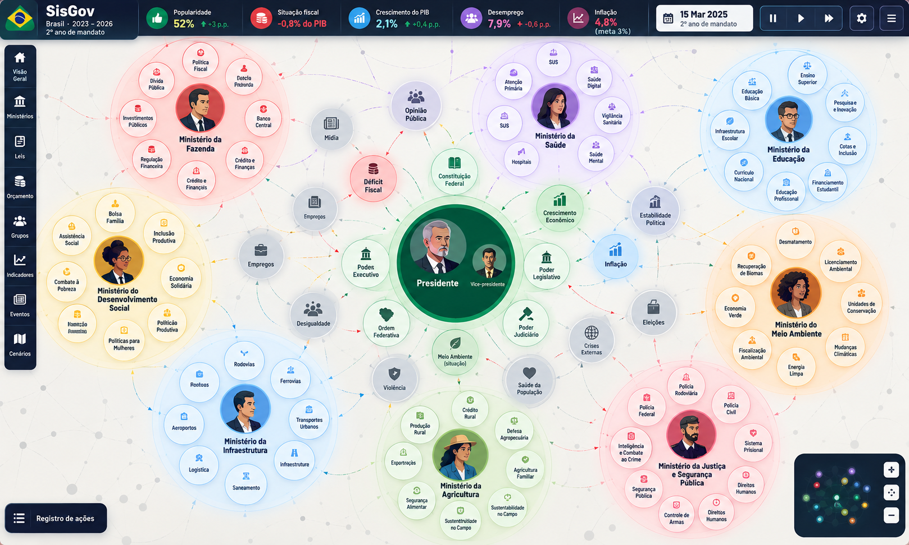

# Referência visual: mapa estratégico da governança brasileira

**Direção visual final indicada pelo usuário em 8 de outubro de 2026.**

Esta referência descreve a imagem de concepção do SisGov: uma tela de jogo
panorâmica, organizada como mapa vivo da governança nacional. O mapa ocupa quase
toda a tela; a interface de jogo fica nas bordas, deixando as relações entre
instituições, ministérios, políticas e resultados como foco principal.
Na imagem de referência, a área de trabalho mede 1618 × 972 pixels; a proporção
é larga, de aproximadamente 5:3.

## Composição da tela

### Barra superior

Uma faixa horizontal azul-marinho atravessa a parte superior. À esquerda, o
símbolo do país acompanha a marca **SisGov**, a identificação **Brasil · 2023 –
2026** e **2º ano de mandato**.

À direita da identificação aparecem cinco cartões de leitura rápida, cada qual
com ícone circular colorido, rótulo, valor destacado e, quando aplicável,
variação:

- **Popularidade:** 52%, com aumento de 3 pontos percentuais.
- **Situação fiscal:** −0,8% do PIB.
- **Crescimento do PIB:** 2,1%, com aumento de 0,4 ponto percentual.
- **Desemprego:** 7,9%, com aumento de 0,6 ponto percentual.
- **Inflação:** 4,8%, com meta indicada de 3%.

Em seguida, um cartão de calendário apresenta **15 Mar 2025** e **2º ano de
mandato**. Os controles agrupados à direita mostram pausar, avançar e avançar
mais rapidamente, seguidos por configurações e menu.

### Navegação lateral

Uma barra vertical escura, ancorada à esquerda, oferece acessos identificados
por ícone e texto: **Visão Geral**, **Ministérios**, **Leis**, **Orçamento**,
**Grupos**, **Indicadores**, **Eventos** e **Cenários**. Ela permanece separada
do campo do mapa e funciona como navegação entre áreas do jogo.

### Campo principal e organização institucional

O campo central tem fundo claro, com uma textura discreta de pontos e linhas
curvas. No centro está a grande esfera verde da Presidência. Dentro dela, o
Presidente ocupa a posição principal, acompanhado pelo Vice-presidente. Em
volta da esfera federal ficam nós institucionais menores, como **Constituição
Federal**, **Poder Executivo**, **Poder Legislativo**, **Poder Judiciário** e
**Ordem Federativa**.

Oito esferas ministeriais coloridas distribuem-se em torno do núcleo federal:

- **Fazenda**, no alto à esquerda, em vermelho.
- **Saúde**, na região superior, em violeta.
- **Educação**, no alto à direita, em azul.
- **Desenvolvimento Social**, à esquerda, em amarelo.
- **Meio Ambiente**, à direita, em laranja.
- **Infraestrutura**, embaixo à esquerda, em azul-claro.
- **Agricultura**, na parte inferior central, em verde-claro.
- **Justiça e Segurança Pública**, embaixo à direita, em rosa-avermelhado.

Cada esfera tem um contorno e uma aura translúcida na cor temática
correspondente. O nome do ministério e o retrato do titular estão no centro.
Suas políticas aparecem como círculos menores organizados ao redor do
representante; cada círculo tem ícone, nome curto e acabamento na cor do
ministério. A cor agrupa visualmente as políticas por área e, nesta imagem, não
é uma escala de aprovação do ministro.

Entre os rótulos legíveis nesses círculos estão **Dívida Pública**,
**Política Fiscal**, **Investimentos Públicos**, **Banco Central** e
**Regulação Financeira** na Fazenda; **SUS**, **Atenção Primária**, **Saúde
Digital**, **Hospitais**, **Saúde Mental** e **Vigilância Sanitária** na Saúde;
**Educação Básica**, **Ensino Superior**, **Pesquisa e Inovação**, **Cotas e
Inclusão**, **Financiamento Estudantil**, **Educação Profissional**, **Currículo
Nacional** e **Infraestrutura Escolar** na Educação; **Bolsa Família**,
**Assistência Social**, **Inclusão Produtiva**, **Economia Solidária**,
**Combate à Pobreza**, **Habitação Inclusiva** e políticas para mulheres no
Desenvolvimento Social; **Economia Verde**, **Recuperação de Biomas**,
**Desmatamento**, **Licenciamento Ambiental**, **Unidades de Conservação**,
**Fiscalização Ambiental**, **Energia Limpa** e **Mudanças Climáticas** no Meio
Ambiente; **Rodovias**, **Ferrovias**, **Transportes Urbanos**, **Aeroportos**,
**Logística** e **Saneamento** na Infraestrutura; **Produção Rural**,
**Crédito Rural**, **Defesa Agropecuária**, **Agricultura Familiar**,
**Exportações**, **Segurança Alimentar** e **Sustentabilidade no Campo** na
Agricultura; e **Polícia Federal**, **Polícia Rodoviária**, **Polícia Civil**,
**Sistema Prisional**, **Inteligência e Combate ao Crime**, **Segurança
Pública**, **Controle de Armas** e **Direitos Humanos** em Justiça e Segurança
Pública.

### Indicadores, situações e relações

Indicadores, condições e instituições que atravessam áreas aparecem como nós
independentes no espaço entre as esferas, sem serem colocados dentro de um
ministério. A imagem mostra, entre outros, **Opinião Pública**, **Mídia**,
**Déficit Fiscal**, **Empregos**, **Desigualdade**, **Crescimento Econômico**,
**Inflação**, **Estabilidade Política**, **Eleições**, **Crises Externas**,
**Saúde da População** e **Violência**.

Esses nós usam cores variadas e ícones próprios para facilitar a identificação.
Linhas finas curvas e tracejadas, com setas, conectam elementos de diferentes
esferas e o centro federal. A malha é distribuída pelo campo inteiro: mostra que
os assuntos se relacionam entre si, em vez de formar painéis isolados por
ministério. A rede de fundo é leve o bastante para não competir com os nomes,
retratos e bolhas.

### Controles nos cantos inferiores

No canto inferior esquerdo há um botão destacado **Registro de ações**, com um
ícone de lista. No canto inferior direito, um minimapa mostra uma versão
compacta da distribuição de nós coloridos e três controles verticais visíveis:
mais, um símbolo de quatro pontos e menos. A imagem não identifica por texto a
ação do controle intermediário.

## Linguagem visual

A imagem combina uma interface escura e compacta nas bordas com um mapa claro,
amplo e luminoso. O azul-marinho unifica a navegação e os dados do cabeçalho; o
verde identifica o centro presidencial; cada ministério recebe uma cor temática
própria. Círculos de tamanhos diferentes estabelecem hierarquia: representantes
e esfera federal têm maior peso visual, políticas são menores e resultados
ficam como nós externos.

O resultado pretendido é uma mesa estratégica de leitura imediata: a pessoa
reconhece o governo e seu período no topo, acessa as áreas do jogo pela lateral
e acompanha a estrutura nacional no mapa, sem transformar a tela principal em
uma tabela ou formulário.

## Limites do que a imagem especifica

Esta imagem define uma direção de apresentação, não o conteúdo normativo do
Brasil nem o comportamento já implementado do jogo.

- País, datas, ano de mandato, valores, metas, variações, rótulos e ministérios
  exibidos são os elementos desta composição visual; números e datas não devem
  ser tratados automaticamente como estado inicial ou parâmetros oficiais.
- A imagem mostra retratos, cores e relações como elementos visuais desejados.
  Isso não significa que a aprovação individual de ministros, todas as
  métricas do cabeçalho ou a navegação completa já estejam implementadas.
- Proximidade, cor, tamanho e linhas servem à leitura visual. Não criam leis,
  autorização, voto, apoio, efeitos nem relações numéricas por conta própria.
  Definições de leis pertencem ao catálogo compartilhado, e cada país declara
  seu estado inicial nos próprios dados.
- As setas devem corresponder a relações declaradas pelo cenário; a disposição
  visual não pode inventar consequências nem isolar o cálculo por ministério.
- O documento registra o alvo visual. Ele não marca chamados de interface como
  concluídos nem afirma que a imagem inteira já funciona em tela.

Os requisitos espaciais e de interação do mapa permanecem detalhados em
[Mapa de influência](mapa-de-influencia.md). O estado real de implementação e
os critérios de produção permanecem no [plano de produção](../plano-de-producao.md).
A tela de entrada que antecede o mapa está descrita em
[Especificação visual: menu inicial do SisGov](menu-inicial-sisgov.md).
